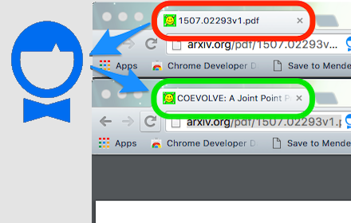

# arXiv titler fixer

Set correct tab `<title>` on arXiv pages.

----

### Adds a little icon to _fix_ the tab title

### Integrates well with [The Great Suspender](https://chrome.google.com/webstore/detail/the-great-suspender/klbibkeccnjlkjkiokjodocebajanakg?hl=en)

----

### Acknowledgement 

Icon made by <a href="http://www.freepik.com" title="Freepik">Freepik</a> from <a href="http://www.flaticon.com" title="Flaticon">www.flaticon.com</a> is licensed by <a href="http://creativecommons.org/licenses/by/3.0/" title="Creative Commons BY 3.0" target="_blank">CC 3.0 BY</a>.
