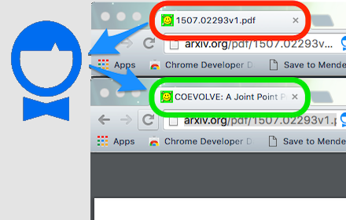
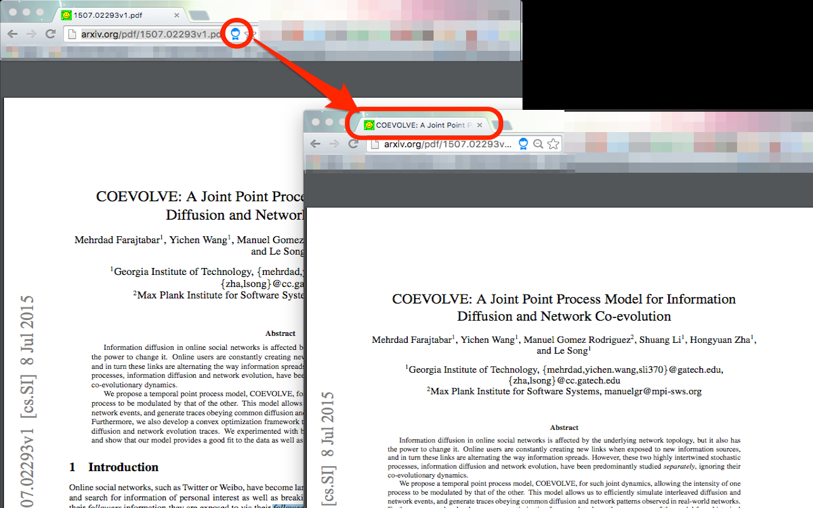
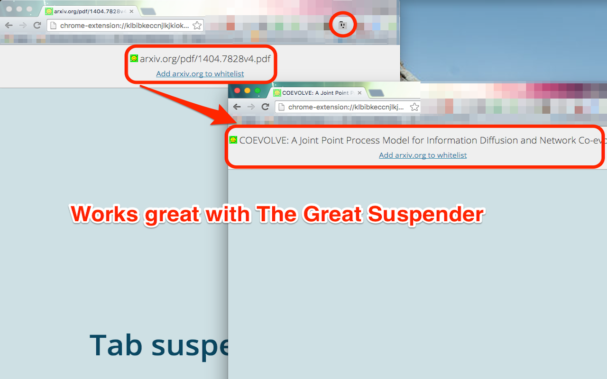
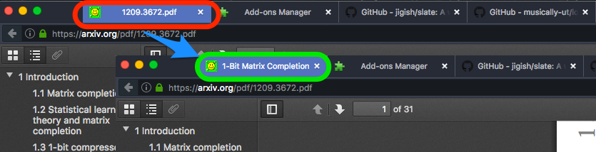
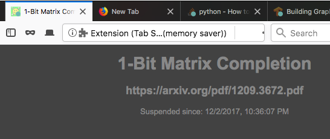

# arXiv titler fixer

Set correct tab `<title>` on arXiv pages.


### Chrome extension

This can be installed standalone from the [Chrome web-store](https://chrome.google.com/webstore/detail/arxiv-title-fixer/pandhendpghoedojdhookbedinmhjien).

[](https://chrome.google.com/webstore/detail/arxiv-title-fixer/pandhendpghoedojdhookbedinmhjien)

### Firefox addon

~~It is also available as an [addon on Firefox](https://addons.mozilla.org/en-US/firefox/addon/arxiv-title-fixer/).~~

Because [Firefox does not allow scripts on pdf pages](https://bugzilla.mozilla.org/show_bug.cgi?id=1454760), the extension does not work.

[j3soon](https://github.com/j3soon) has created a clever workaround [j3soon/arxiv-utils](https://github.com/j3soon/arxiv-utils) which does work. 


### Userscript

[o-jasper](https://github.com/o-jasper) created a [userscript](https://gist.github.com/o-jasper/df6f93e8c1a9ec8d3ff59f0266dfe368) version for use with [Greasemonkey](https://addons.mozilla.org/en-US/firefox/addon/greasemonkey/) for Firefox or [Tampermonkey](https://chrome.google.com/webstore/detail/tampermonkey/dhdgffkkebhmkfjojejmpbldmpobfkfo?hl=en) for Blink based browsers!

----

# Usage


<p style="text-align: center">

</p>

### Adds a little icon to _fix_ the tab title


<p style="text-align: center">

</p>

### Integrates well with [The Great Suspender](https://chrome.google.com/webstore/detail/the-great-suspender/klbibkeccnjlkjkiokjodocebajanakg?hl=en)


<p style="text-align: center">

</p>

### Works with Firefox as well!

<p style="text-align: center">

</p>

### Integrates well with [Tab Suspender](https://addons.mozilla.org/en-US/firefox/addon/tab-suspender-tab-unloader/)

<p style="text-align: center">

</p>

----

## Development

Please install the following before building the extension:

  - [`web-ext`](https://developer.mozilla.org/en-US/Add-ons/WebExtensions/Getting_started_with_web-ext)
  - [`jq`](https://stedolan.github.io/jq/) **Note:** This is not the `jq` on NPM, which is a server-side `jQuery` replacement.

The project is supplied with a `Makefile` which can produce final files for both Firefox and Chrome.

```bash
make chrome
make firefox
```

The build is done by selectively copying parts of the source code to the folder `./.tmp` and then archiving it again using either `zip` (for Chrome) or `web-ext` (for Firefox).
The final archives are kept in the `./build` folder.

For testing, the extension can be loaded into Chrome by going to [chrome://extensions](chrome://extensions) and clicking on the <kbd>Load Unpacked Extension</kbd> button.
Then navigate to the `.tmp` folder in the source code root which was created by running `make chrome` and load it. An alternate is to run `make manifest` in the root folder and then load the source code root as the unpacked extension. This will allow for a simpler edit-reload cycle, except while editing `manifest.json.template`.

For Firefox, the easiest way to test the packaged extension would be to download the [unbranded build](https://wiki.mozilla.org/Add-ons/Extension_Signing#Latest_Builds) or the [Developer Edition](https://www.mozilla.org/en-GB/firefox/developer/) and loading the extension there. Otherwise, one would need to _sign_ the extension via your account on their Addon server. Go to [`about:addons`](about:addons), to the _Extensions_ Tab and click the Gear icon (Settings) on the top right to load the packed extension.

If the browser still complains that the package has not been signed, then go to [`about:config`](about:config) and set `xpinstall.signatures.required` to `false`. Note that this setting only takes effect on the Developer Edition and the Unbranded versions of the browser even though it shows up in `about:config` pages of the release channel versions as well.


### Acknowledgement 

Icon made by <a href="http://www.freepik.com" title="Freepik">Freepik</a> from <a href="http://www.flaticon.com" title="Flaticon">www.flaticon.com</a> is licensed by <a href="http://creativecommons.org/licenses/by/3.0/" title="Creative Commons BY 3.0" target="_blank">CC 3.0 BY</a>.
